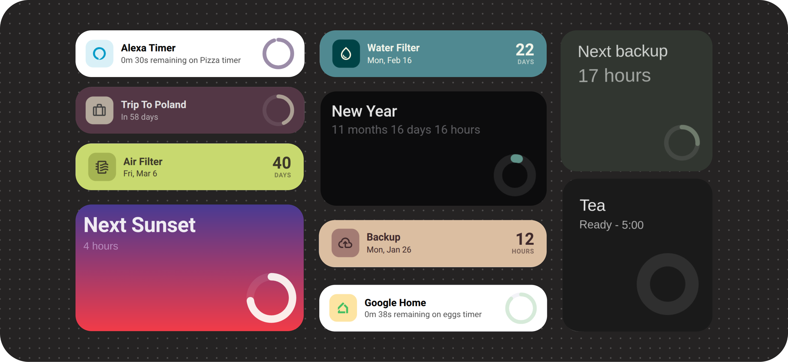

# TimeFlow Card


A beautiful, highly customizable time card for Home Assistant. Use it as a countdown to an upcoming date, a count-up timer since a past event, or a live view of Home Assistant, Alexa, and Google Home timers. It includes multiple layouts, progress-circle options, a visual editor, and built-in Jinja2 template support.

[![Home Assistant][ha_badge]][ha_link] [![HACS][hacs_badge]][hacs_link] [![GitHub Release][release_badge]][release] [![Buy Me A Coffee][bmac_badge]][bmac] ![downloads]


## Table of contents

**[`Installation`](#installation)**  **[`Configuration`](#configuration)** **[`Examples`](#examples)** **[`Styling`](#styling)** **[`Templates`](#-template-support)** 
<br>

## Installation

#### HACS (Recommended)

<div align="left">
  <a href="https://my.home-assistant.io/redirect/hacs_repository/?owner=rishi8078&repository=Timeflow-card" target="_blank" rel="noopener noreferrer">
    
  </a>
</div>

####  Manual Installation

1.  Download `timeflow-card.js` from the latest [release](https://github.com/Rishi8078/TimeFlow-Card/releases).
2.  Copy the file to your `config/www/` directory.
3.  Add the card to your resources:
    ```yaml
    resources:
      - url: /local/timeflow-card.js
        type: module
    ```

## Configuration

This card offers a wide range of options to customize its appearance and behavior. `target_date` is the primary date field:

- In `mode: count_down`, `target_date` is the end date.
- In `mode: count_up`, `target_date` is the start or "since" date.

If `timer_entity` or smart-timer auto-discovery is used, timer data takes priority over date-based calculations.

| Option | Type | Default | Description |
| :-- | :-- | :-- | :-- |
| `style` | string | `classic` | Card layout: `classic`, `eventy`, or `classic-compact`. |
| `mode` | string | `count_down` | Time mode: `count_down` or `count_up`. |
| `target_date` | string | `null` | Main date field. In count-down mode this is the target date. In count-up mode this is the start date. Supports ISO strings, entity IDs, and templates. |
| `creation_date` | string | `null` | Optional start date for count-down progress calculations. Supports ISO strings, entity IDs, and templates. |
| `progress_offset` | number | `null` | Number of seconds to offset the progress circle only (does not affect the countdown text). Positive values delay the progress, negative values move it ahead. Examples: `300` (5 min late), `-60` (1 min early). |
| `count_up_goal_date` | string | `null` | Optional goal/end date for count-up progress. Supports ISO strings, entity IDs, and templates. |
| `count_up_cycle` | string / number | `null` | Optional repeating count-up cycle such as `30d`, `12h`, `24:00:00`, or raw seconds. Supports templates. |
| `timer_entity` | string | `null` | Home Assistant `timer`, `sensor`, or `input_datetime` entity. Overrides date-based display logic. |
| `auto_discover_alexa` | boolean | `false` | Automatically discover Alexa timer entities from the Alexa Media Player integration. |
| `auto_discover_google` | boolean | `false` | Automatically discover Google Home timer entities from the HA Google Home integration. |
| `title` | string | auto | Card title. Falls back to an automatic title when omitted. Supports templates. |
| `subtitle` | string | `null` | Optional subtitle override. Supports templates. |
| `subtitle_prefix` | string | `null` | Text prepended to the generated subtitle, such as `in` or `Only`. |
| `subtitle_suffix` | string | `null` | Text appended to the generated subtitle, such as `left` or `elapsed`. |
| `header_icon` | string | `null` | Optional Material Design icon shown next to the title in all styles. |
| `header_icon_color` | string | `null` | Optional header icon color. Supports templates. |
| `header_icon_background` | string | `null` | Optional background color behind the header icon. Supports templates. |
| `show_years` | boolean | `false` | Show years in the elapsed or remaining time output. |
| `show_months` | boolean | `false` | Show months in the elapsed or remaining time output. |
| `show_weeks` | boolean | `false` | Show weeks in the elapsed or remaining time output. |
| `show_days` | boolean | `true` | Show days in the elapsed or remaining time output. |
| `show_hours` | boolean | `true` | Show hours in the elapsed or remaining time output. |
| `show_minutes` | boolean | `true` | Show minutes in the elapsed or remaining time output. |
| `show_seconds` | boolean | `true` | Show seconds in the elapsed or remaining time output. |
| `compact_format` | boolean | auto | Use compact unit formatting such as `2d 5h 30m`. When unset, compact formatting is auto-enabled when 3 or more units are shown. |
| `text_color` | string | theme | Primary text color. Supports templates. |
| `background_color` | string | theme | Card background color. Supports templates. |
| `progress_color` | string | theme | Progress-circle color. Supports templates. |
| `icon_size` | number | `100` | Base progress circle size in pixels. Auto-scales with the card dimensions. |
| `stroke_width` | number | `15` | Thickness of the progress circle stroke. |
| `progress_bg_stroke` | string | `#FFFFFF1A` | Background track color for the progress circle. |
| `progress_bg_opacity` | number | theme | Background track opacity percentage from `0` to `100`. |
| `invert_progress` | boolean | `false` | Start the progress circle full and subtract from it instead of filling it up. |
| `width` / `height` | string / number | `null` | Fixed card dimensions, for example `"200px"`, `"100%"`, or `180`. |
| `aspect_ratio` | string | `null` | Aspect ratio for responsive sizing, for example `"1/1"` or `"16/9"`. |
| `expired_text` | string | localized | Text shown when a countdown completes. Supports templates. |
| `expired_animation` | boolean | `true` | Enables the celebration animation when a countdown expires. |
| `tap_action` | object | auto | Tap action for the card. Timer entities default to `more-info` when no tap action is set. |
| `hold_action` | object | `null` | Hold action for the card. |
| `double_tap_action` | object | `null` | Double-tap action for the card. |
| `card_mod` | object | `null` | Advanced styling via [card-mod](https://github.com/thomasloven/lovelace-card-mod) integration. |


## Examples


### 🏠 Count-Up Since Move-In

Track elapsed time since a past event using `mode: count_up`. This example uses the `classic-compact` layout, an optional header icon, an inverted progress ring, and a `count_up_goal_date` so the circle has a meaningful end point. If you prefer a repeating ring instead, replace `count_up_goal_date` with `count_up_cycle: 30d`.

<details>
<summary>View YAML</summary>

```yaml
type: custom:timeflow-card
style: classic-compact
mode: count_up
title: Time Since Move-In
subtitle_suffix: lived here
target_date: "2025-06-01T10:30:00"
count_up_goal_date: "2026-06-01T10:30:00"
show_years: false
show_months: false
show_weeks: false
show_days: true
show_hours: true
show_minutes: true
show_seconds: false
header_icon: mdi:home-heart
header_icon_color: "#6E4B2F"
header_icon_background: "rgba(110, 75, 47, 0.12)"
background_color: "#FFF8F1"
text_color: "#4A3828"
progress_color: "#C77D4E"
progress_bg_stroke: "#E8D6C5"
progress_bg_opacity: 100
invert_progress: true
stroke_width: 10
```

</details>

-----

### 🗂️ Eventy Style 

The `eventy` layout is the most compact style and now works cleanly with or without a header icon. If no `header_icon` is provided, the title shifts over automatically and the layout stays aligned.

<details>
<summary>View YAML</summary>

```yaml
type: custom:timeflow-card
style: eventy
title: Next Bin Collection
target_date: sensor.next_bin_collection
show_years: false
show_months: false
show_weeks: false
show_days: true
show_hours: false
show_minutes: false
show_seconds: false
background_color: "#F3F7F2"
text_color: "#243026"
progress_color: "#5E8C61"
expired_animation: false
```

</details>

-----

### 🗓️ Daily Agenda Countdown


This is a smart "Daily agenda" card. It automatically updates to show you what's next on your calendar for the day and elegantly hides the countdown when there's nothing scheduled.

**Note:** Remember to replace `calendar.your_calendar_entity` with your own calendar entity ID.

<details>
<summary>View YAML</summary>

```yaml
type: custom:timeflow-card
title: >-
   
    {{ state_attr('calendar.your_calendar_entity', 'message') }}
  
    No Events Today
  
target_date: >-
   
    {{ event }}
  
    2000-01-01T00:00:00  # A past date to prevent the countdown
  
creation_date: "{{ now().replace(hour=0, minute=0, second=0, microsecond=0).isoformat() }}"
show_months: false
show_days: true
show_hours: true
show_minutes: true
show_seconds: false
background_color: "#075056"
text_color: "#E4EEF0"
progress_color: "#FF5B04"
expired_animation: false
expired_text: Enjoy Your Day!
stroke_width: 10
card_mod:
  style: |
    ha-card .title {
      font-size: 2.2rem;
    }
    ha-card .subtitle {
      font-size: 1.0rem;
    }
```
</details>

-----

### ☀️ Daily Progress Tracker


Track the current day. The progress circle fills up as the day goes on, and the subtitle dynamically displays the percentage of the day that has passed.

<details>
<summary>View YAML</summary>

```yaml
type: custom:timeflow-card
title: Today
subtitle: " {{ (now().hour / 24 * 100) | round() }}%"
target_date: >-
  {{ (now().replace(hour=23, minute=59,
  second=59)).strftime('%Y-%m-%dT%H:%M:%S') }}
creation_date: "{{ now().replace(hour=0, minute=0, second=0).strftime('%Y-%m-%dT%H:%M:%S') }}"
show_days: false
show_hours: true
show_minutes: true
show_seconds: true
aspect_ratio: 1/1
height: 180
icon_size: 60
text_color: "#424244"
background_color: "#FAFEFE"
progress_color: "#FB4E5B"
stroke_width: 6
card_mod:
  style:
    .: |
      ha-card .title {
        font-size: 1.2rem;
      }
      ha-card .subtitle {
        font-size: 2rem;
      }
    progress-circle$: |
      .progress-bg {
        stroke: #E5E6EA; /* Dark gray background track */
      }
```

</details>

-----

### 🎂 Dynamic Birthday Countdown


A fully automated birthday countdown. It calculates the person's upcoming age and even changes its color scheme based on the birth month. Simply fill in the name and birthdate in the designated `title`, `target_date`, and `text_color` sections to personalize it for anyone.

<details>
<summary>View YAML</summary>

**To customize for different people, you need to update the variables in three places:**

1.  **In the `title` section** - change these 4 variables:
    ```yaml
    
    
    
    
    ```
2.  **In the `target_date` section** - change these 2 variables:
    ```yaml
    
    
    ```
3.  **In the `text_color` section** - change these 2 variables:
    ```yaml
    
    
    ```
    


```yaml
type: custom:timeflow-card
title: >-
  
  
  
  
  
  
  
    
  
    
  
  
  {{ person_name }}'s {{ age }}{{ 
    'st' if age % 10 == 1 and age % 100 != 11 else
    'nd' if age % 10 == 2 and age % 100 != 12 else
    'rd' if age % 10 == 3 and age % 100 != 13 else
    'th'
  }} Birthday

target_date: >-
  
  
  
  
  
    
  
    
  
  {{ next_birthday.isoformat() }}

creation_date: >-
  
  
  {{ start_of_year.isoformat() }}

show_days: true
show_hours: true
show_minutes: true
show_seconds: false

text_color: >-
  
  
  
  
  
    
  
    
  
  
  
    #FF6B6B
  
    #4ECDC4
  
    #45B7D1
  
    #96CEB4
  

background_color: "#2C3150"
progress_color: "#D0CFCF"
aspect_ratio: 4/2
stroke_width: 6

card_mod:
  style: |
    ha-card .title {
      font-size: 2.2rem;
    }
    ha-card .subtitle {
      font-size: 2.0rem;
    }
```
</details>


-----

### 🌅 Automatic Sunrise & Sunset Card


A fully automatic countdown to the next sunrise or sunset. It dynamically changes its title and target based on the time of day.

<details>
<summary>View YAML</summary>

```yaml
type: custom:timeflow-card
title: "{{ ' Sunrise' if states('sun.sun') == 'below_horizon' else 'Next Sunset' }}"
target_date: >-
  {{ states('sensor.sun_next_rising') if states('sun.sun') == 'below_horizon'
  else states('sensor.sun_next_setting') }}
creation_date: |-
  
    {{ (states('sensor.sun_next_setting') | as_datetime).replace(day=(states('sensor.sun_next_setting') | as_datetime).day - 1).isoformat() }}
  
    {{ (states('sensor.sun_next_rising') | as_datetime).replace(day=(states('sensor.sun_next_rising') | as_datetime).day - 1).isoformat() }}
  
show_days: false
show_hours: true
show_minutes: false
show_seconds: false
icon_size: 100
aspect_ratio: 16/9
progress_color: "#FFFFFA"
card_mod:
  style: |
    ha-card {
      background-image: linear-gradient(to top, #f43b47 0%, #453a94 100%)!important;
      border-radius: 32px !important;
      box-shadow:
        0 8px 24px rgba(161, 140, 209, 0.4),
        inset 0 1px 0 rgba(255, 255, 255, 0.1) !important;
      transition: transform 0.2s ease-in-out;
    }
    ha-card .title {
      font-family: "SF Pro Text", -apple-system, BlinkMacSystemFont, "Segoe UI", Roboto, Helvetica, Arial, sans-serif;
      font-weight: 600;
      font-size: 3rem;
      color: #FFFFFF;

    }
    ha-card .subtitle {
      color: #D6B7E4; /* Soft complementary color */
      font-size: 1.5rem;
      font-weight: 400;
    }
```
</details>


-----

### 🛋️ Weekend Countdown


Automatically counts down to your weekend. During the week, it shows the time remaining until Friday at 6 PM. Once the weekend begins, it switches to count down to the start of the work week on Monday morning.

<details>
<summary>View YAML</summary>

```yaml
type: custom:timeflow-card
title: >-
   {{ 'Enjoy your weekend' if wd >= 5 else
  'Next Weekend Countdown' }}
target_date: |-
  
  
    {# Weekend - countdown to Monday 9 AM #}
    
    {{ (now() + timedelta(days=days_until_monday)).replace(hour=9, minute=0, second=0, microsecond=0).isoformat() }}
  
    {# Weekday - countdown to next Friday 6 PM #}
    
    {{ (now() + timedelta(days=days_until_friday)).replace(hour=18, minute=0, second=0, microsecond=0).isoformat() }}
  
creation_date: |-
  
  
    {# Weekend started Friday 6 PM #}
    
    {{ (now() - timedelta(days=days_since_friday)).replace(hour=18, minute=0, second=0, microsecond=0).isoformat() }}
  
    {# Weekday started Monday 9 AM #}
    
    {{ (now() - timedelta(days=days_since_monday)).replace(hour=9, minute=0, second=0, microsecond=0).isoformat() }}
  
show_days: true
show_hours: true
show_minutes: false
show_seconds: false
text_color: "#E3943B"
background_color: "#2B362E"
progress_color: "#E3943B"
icon_size: 150
height: 280px
stroke_width: 10
card_mod:
  style: |
    ha-card .title {
      font-size: 2.2rem;
    }
    ha-card .subtitle {
      font-size: 1.0rem;
    }

```
</details>

-----

### 🍕 Pizza Timer with Safety Buffer


A practical timer that uses `progress_offset` to complete the progress circle 2 minutes before the actual timer ends, giving you time to prepare and get the pizza out safely.

<details>
<summary>View YAML</summary>

```yaml
type: custom:timeflow-card
title: "🍕 Pizza in Oven"
target_date: "{{ now() + timedelta(minutes=15) }}"
creation_date: "{{ now() }}"  # 15 minutes total
progress_offset: 120    # Progress completes 2 min early
progress_color: "#FF6B35"
background_color: "#1a1a1a"
text_color: "#FFFFFF"
expired_text: "Pizza is ready! 🍕"
show_hours: false
show_minutes: true
show_seconds: true
stroke_width: 12
card_mod:
  style: |
    ha-card .title {
      font-size: 2rem;
    }
```

**How it works:**
- Countdown text shows the actual time remaining (15:00 → 00:00)
- Progress circle reaches 100% at 02:00 (2 minutes before timer ends)
- Gives you a visual heads-up to prepare before the pizza is done

</details>

-----

### 💾 Grid Layout with Multiple Timers


Use a `grid` card to display multiple countdowns side-by-side. This example shows a long-term travel countdown next to a dynamic countdown for the next scheduled backup.

**Note:** Remember to replace the `sensor.backup_...` entities with your own backup sensors.

<details>
<summary>View YAML</summary>

```yaml
square: false
type: grid
cards:
  - type: custom:timeflow-card
    title: Going Home
    target_date: "2025-09-12T13:43:50"
    background_color: "#1F033A"
    text_color: "#E1C5FC"
    progress_color: "#9C3DF5"
    show_seconds: false
    show_minutes: false
    show_hours: false
    show_days: true
    show_months: false
    creation_date: "2025-07-12T13:43:50"
    height: 180
    icon_size: 80
    card_mod:
      style:
        .: |
          ha-card .title {
            font-size: 1.2rem;
          }
          ha-card .subtitle {
            font-size: 1rem;
          }
        progress-circle$: |
          .progress-bg {
            stroke: #E5E6EA; /* Dark gray background track */
          }
  - type: custom:timeflow-card
    title: Next backup
    target_date: sensor.backup_next_scheduled_automatic_backup
    background_color: "#313630"
    text_color: "#DFE2DF"
    progress_color: "#768273"
    show_seconds: false
    show_minutes: false
    show_hours: true
    show_days: false
    show_months: false
    creation_date: sensor.backup_last_successful_automatic_backup
    card_mod:
      style: |
        ha-card .title {
          font-size: 1.2rem;
        }
        ha-card .subtitle {
          font-size: 1.0rem;
        }
    aspect_ratio: 1/1
    height: 180
    icon_size: 80
columns: 2

```
</details>

----

## Styling 

For most setups, start with the built-in options such as `style`, `background_color`, `text_color`, `progress_color`, `progress_bg_stroke`, `progress_bg_opacity`, `header_icon`, and `invert_progress`. For full control over every element of the card, the [card-mod](https://github.com/thomasloven/lovelace-card-mod) integration is the recommended approach. It lets you write custom CSS to override the default styles of the card and its sub-components.

### Card Elements

This table includes the primary structural elements you can target with CSS selectors like `card-mod`.

| Element | Selector | Example Customizations |
| :--- | :--- | :--- |
| **Card** | `ha-card` | Change the `background`, `border-radius`, or add a `box-shadow`. |
| **Card Content** | `.card-content` | Adjust `padding`, `background`, or control the flexbox layout (`justify-content`). |
| **Header** | `.header` | Modify `margin-bottom` or change the alignment of items within the header. |
| **Title Section** | `.title-section` | Add a `border` around the title/subtitle area or change its `gap`. |
| **Title** | `.title` | Adjust `font-size`, `color`, `font-weight`, and `line-height`. |
| **Subtitle**| `.subtitle` | Modify `font-size`, `color`, `opacity`, and `font-style` (e.g., italic). |
| **Header Icon** | `.header-icon` | Change icon container `background`, `border-radius`, `padding`, or size variables. |
| **Content Area**| `.content` | Change the alignment (`align-items`, `justify-content`) of the progress circle area. |
| **Progress Section**| `.progress-section` | Adjust margins or positioning of the progress circle container. |
| **Progress Circle**| `.progress-circle` | Apply a `filter` like `drop-shadow` or adjust its `opacity`. |
| **Eventy Layout** | `.card-content-list` | Adjust the compact grid, padding, and spacing for the `eventy` style. |
| **Eventy Icon** | `.list-icon` | Customize the optional compact icon in the `eventy` style. |
| **Eventy Text** | `.list-title-section`, `.list-title`, `.list-subtitle` | Style the title and subtitle block for the `eventy` layout. |
| **Eventy Countdown** | `.list-countdown`, `.list-countdown-value`, `.list-countdown-unit` | Control the prominent value and unit shown on the right side of the `eventy` layout. |
| **Classic Compact Layout** | `.card-content-compact` | Adjust the grid, padding, and spacing for the `classic-compact` style. |
| **Classic Compact Icon** | `.compact-icon` | Customize the optional icon in the `classic-compact` style. |
| **Classic Compact Text** | `.compact-title-section`, `.compact-title`, `.compact-subtitle` | Style the title and subtitle block for the compact circle layout. |
| **Classic Compact Progress** | `.compact-progress` | Reposition or size the progress circle in the `classic-compact` layout. |


> [!IMPORTANT]  
> Please note that you might have to add `!important;` to some CSS styles that are already defined (see examples below).
#### Examples

> [!NOTE]
> Click on the headings below to expand the code and see the examples.

<details>

<summary>Changing the font size of Title & Subtitle</summary>


<br>

```yaml
card_mod:
  style: |
    ha-card .title {
      font-size: 3rem;       
      font-weight: bold;
      line-height: 1.2;
    }
    ha-card .subtitle {
      font-size: 1.4rem;    
    }
```

</details>

<details>

<summary>Applying a gradient background with borders and shadows to a card </summary>


<br>

```yaml
card_mod:
  style: |
    ha-card {
      background-image: linear-gradient(to top, #f43b47 0%, #453a94 100%)!important;
      border-radius: 32px !important;
      box-shadow:
        0 8px 24px rgba(161, 140, 209, 0.4),
        inset 0 1px 0 rgba(255, 255, 255, 0.1) !important;
      transition: transform 0.2s ease-in-out;
    }
```
</details>

<details>

<summary>Changing the layout to side by side to create a more compact card</summary>


<br>

```yaml
card_mod:
  style: |
    .card-content {
      flex-direction: row !important;
      align-items: center !important;
      justify-content: space-between !important;
    }
    .header {
      margin-bottom: 0 !important;
    }
    .content {
      margin-top: 0 !important;
    }
```

</details>


<details>

<summary>Changing the progress track color with built-in options</summary>


<br>

```yaml
progress_bg_stroke: "#E5E6EA"
progress_bg_opacity: 100
```

</details>

<details>

<summary>Changing the background to an image</summary>


**Note**: To use your own image, replace `/local/study.gif` in the code below with the path to your image or gif file. Your image should be located in your Home Assistant's `config/www` directory.

<br>

```yaml
card_mod:
  style: |
    ha-card {
      position: relative;
      overflow: hidden;
      background-color: transparent !important;
    }
    ha-card::before {
      content: "";
      position: absolute;
      top: 0; right: 0; bottom: 0; left: 0;
      background: url("/local/study.gif") center/cover no-repeat;
      /* adjust the blur radius to taste */
      filter: blur(0.2px);
      /* scale up slightly so edges don’t show when blurred */
      transform: scale(1.1);
      z-index: 1;
    }
    ha-card::after {
      content: "";
      position: absolute;
      top: 0; right: 0; bottom: 0; left: 0;
      background-color: rgba(0,0,0,0.35);
      z-index: 2;
    }
```

</details>
<details>

<summary>Classic iPod vibes</summary>


<br>

```yaml
card_mod:
  style: |
    .title-section {
      background: rgba(0, 0, 0, 0.2);
      border-radius: 12px;
      padding: 40px;
      gap: 8px !important;
    }
```

</details>

## 📝 Template Support

Templates can be used in the following properties for dynamic content:

  - `title`
  - `subtitle`
  - `target_date`
  - `creation_date`
  - `count_up_goal_date`
  - `count_up_cycle`
  - `timer_entity`
  - `text_color`
  - `background_color`
  - `progress_color`
  - `expired_text`
  - `header_icon`
  - `header_icon_color`
  - `header_icon_background`

#### Example


A card to track the life of your HVAC filter. It dynamically changes its progress and background colors to give you a quick visual cue as the replacement date gets closer.

**Note**: Remember to create an `input_datetime` helper in Home Assistant to store your last filter change date and replace `input_datetime.last_hvac_filter_change` in the code with your own entity ID.

<details>

<summary>View YAML</summary>

```yaml
type: custom:timeflow-card
title: HVAC Filter Countdown
creation_date: "{{ states('input_datetime.last_hvac_filter_change') }}"
target_date: >-
  {{ (as_datetime(states('input_datetime.last_hvac_filter_change')) +
  timedelta(days=90)).isoformat() }}
text_color: "#FFFFFF"
progress_color: >-
   
  {{ '#D32F2F' if days_remaining <= 3 else '#F57C00' if days_remaining <= 7 else
  '#1976D2' }}
background_color: >-
   
  {{ '#2C1810' if days_remaining <= 3 else '#2D1F0A' if days_remaining <= 7 else
  '#0D1A2E' }}
show_days: true
show_hours: false
show_minutes: false
show_seconds: false
stroke_width: 1
expired_text: 🔧 Filter Change Due!
card_mod:
  style: |
    ha-card .title {
      font-size: 1.3rem;
      font-weight: bold;
      text-shadow: 0 1px 2px rgba(0,0,0,0.5);
    }
    ha-card .subtitle {
      opacity: 0.85;
      font-weight: 500;
    }

```
</details>

---
## 📄 License

MIT License - see the [LICENSE](https://www.google.com/search?q=LICENSE) file for details.

## ☕ Support Development

If you find this card useful, please consider supporting its development. Your contribution helps keep the project alive and growing.

<a href="https://coff.ee/rishi8078" target="_blank"></a>
-----

**TimeFlow Card - Made with ❤️ for the Home Assistant community**

<!-- Link references -->
[ha_badge]: https://img.shields.io/badge/Home%20Assistant-Compatible-green
[ha_link]: https://www.home-assistant.io/
[hacs_badge]: https://img.shields.io/badge/HACS-Compatible-orange
[hacs_link]: https://hacs.xyz/
[release_badge]: https://img.shields.io/github/v/release/Rishi8078/TimeFlow-Card
[release]: https://github.com/Rishi8078/TimeFlow-Card/releases
[bmac_badge]: https://img.shields.io/badge/buy_me_a-coffee-yellow
[bmac]: https://coff.ee/rishi8078
[Stars]:https://img.shields.io/github/stars/Rishi8078/TimeFlow-Card
[Last commit]:https://img.shields.io/github/last-commit/Rishi8078/TimeFlow-Card
[downloads]:https://img.shields.io/github/downloads/Rishi8078/TimeFlow-Card/total?style=flat-square
